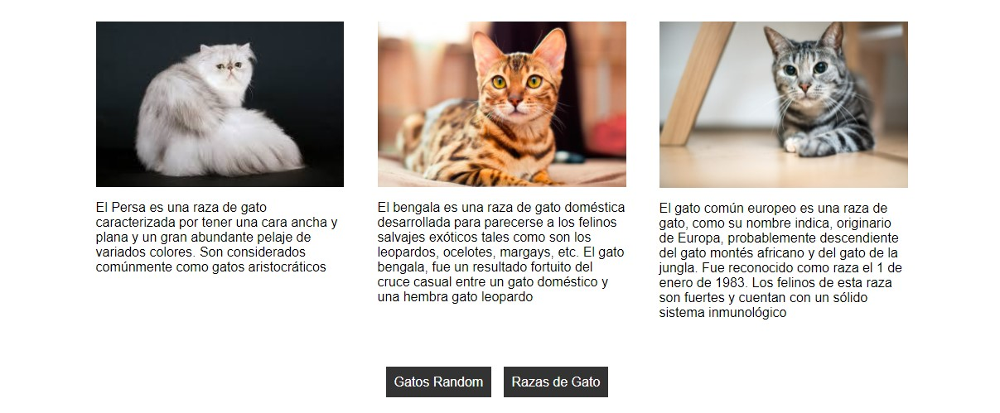
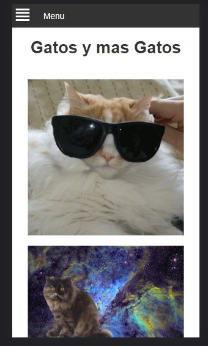

# cat-web
una web de gatitos y mas

#### preview



### primero por supuesto debe tener instalado <a href="https://python.org">python<a>

### clonar repo
```
git clone https://github.com/janselroa/cat-web
```
### ir a carpeta del repo
```
cd cat-web
```

### Instalar y configurar entorno virtual
```
pip install pipenv
```
#### una ves instalado 
```
pipenv shell
```

### Instalar dependencias
```
pip install -r requirements.txt 
```

### listo ahora valla a <a href="http://localhost:5000">localhost:5000<a>
